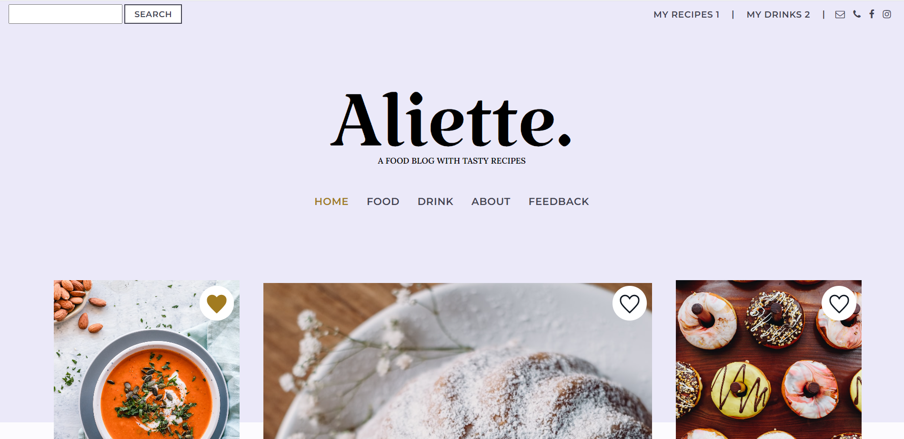

# Developing a WordPress Theme with Vue.js
The purpose of this project was to create a WordPress theme using <b>the WordPress REST API</b> and <b>Vue.js</b>. This WordPress theme uses <b>Vue 3</b> with <b>Vue CLI</b> bundler, which allows to create .vue files inside a WordPress theme. More technical information about how to set up the Vue app inside WordPress you can find in the <a href="/frontend/#readme">README file</a> of the frontend folder. This WordPress theme is built using <b>Bootstrap 4</b> as well. 

Vue can bring a lot of different functionalities and features. By using Vue in a WordPress theme, you can combine best in-built WordPress features with dynamic Vue functionalities and make your WordPress website more interactive and modern. You can utilize in your WordPress theme Vue’s features such as single-file components, custom events, computed properties, lifecycle hooks, Vuex, as well as Axios to interact with the WordPress REST API. Vue takes your WordPress website to another level and helps to meet changing needs and expectations of today’s users.

## About the project

Aliette is a food blog created by using WordPress and Vue.js.  The blog includes food and drink recipes. By using <b>WordPress CMS</b>, it's easy to add new recipes to the blog and organize them by categories and tags. The blog users can easily sort recipes by categories and tags. This WordPress website is built using only two WordPress plugins, <b>Advanced Custom Fields</b> and <b>Custom Post Type UI</b>. <b>Advanced Custom Fields</b> plugin is used to store recipe information and <b>Custom Post Type UI</b> plugin is used to create custom post types for food and drink recipes.
 
Vue enables to make a WordPress theme more dynamic and add new features to it. The WordPress theme contains Vue components which are organized according to blog features and actions. These Vue components are responsible for dropdown menus, sliders, tabs and other functionalities that are placed on the blog. The most important dynamic feature of this blog is adding recipes to Favorites list. It's also easy to delete recipes from the list. Additionally, the Vue frontend uses <b>Vuex</b> to manage the states of recipe lists.    

Below is a gif that illustrates dynamic features of the blog that are made by using Vue.

 
 
